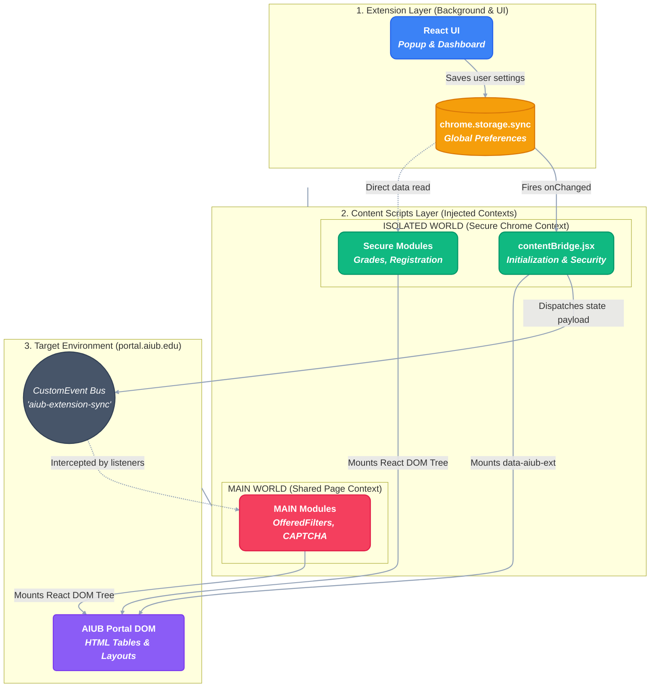

<div align="center">
  

  # AIUB Portal+ 🚀

  **A comprehensive Chrome extension that supercharges the official AIUB Student Portal with a modern UI, intelligent scheduling, grade analytics, and financial insights.**

  <br />

  <p>
    <a href="https://react.dev"></a>
    <a href="https://vitejs.dev"></a>
    <a href="https://tailwindcss.com"></a>
    <a href="https://developer.chrome.com/docs/extensions/mv3/"></a>
    <a href="https://github.com/mdrijoanmaruf/AIUB-Plus-Extenstion"></a>
    <a href="LICENSE"></a>
  </p>

  <a href="https://chromewebstore.google.com/detail/aiub-portal+/fjabnpkpkjdeblonjloimdamobghofel">
    
  </a>

  <br />
  <br />

  **[Install Extension](https://chromewebstore.google.com/detail/aiub-portal+/fjabnpkpkjdeblonjloimdamobghofel)** &nbsp; · &nbsp; **[GitHub Repository](https://github.com/mdrijoanmaruf/AIUB-Plus-Extenstion)**
</div>

---

## 📋 Table of Contents

- [What This Extension Does](#-what-this-extension-does)
- [How It Works (Architecture)](#-how-it-works-architecture)
- [What's New in v3.5.1](#-whats-new-in-v351)
- [What's New in v3.1.0](#-whats-new-in-v310)
- [Tech Stack](#-tech-stack)
- [Features by Portal Page](#-features-by-portal-page)
- [Project Structure](#-project-structure)
- [Installation & Setup](#-installation--setup)
- [NPM Scripts](#-npm-scripts)
- [Configuration and Data Files](#-configuration-and-data-files)
- [Permissions and Privacy](#-permissions-and-privacy)
- [Troubleshooting](#-troubleshooting)
- [Known Limitations](#-known-limitations)
- [Changelog](#-changelog)

---

## 🌟 What This Extension Does

### ✨ Special Features

- 🤖 **Auto Captcha Calculation:** Instantly and accurately solves math CAPTCHAs during login using offline OCR.
- 🔍 **Advanced Offered Course Filter:** Deep search and filter with smart clash detection.
- 📅 **Routine Generation:** Automatically visualizes your selected courses in a beautiful weekly schedule.
- 🔓 **Show Locked / Unlocked Courses [CSE only]:** Injects prerequisite data to instantly show which courses you can take.
- 🔔 **Live AIUB Notices:** Read the latest AIUB notices directly inside your portal via a native notification bell.

AIUB Portal+ adds page-specific enhancements on [https://portal.aiub.edu](https://portal.aiub.edu) for:

| Page | Enhancement |
| ------ | ------------- |
| **Offered Courses** | Search, filters, clash checking, section selection, routine generation & PNG export |
| **Registration** | Cleaner cards, semester switch, credit summary, print shortcut |
| **Registration Print** | Fully redesigned payment print page with payment cards, bank selector & trust footer |
| **Course Results** | Modernized display with expandable section cards |
| **Grade Reports** | Curriculum-wise and semester-wise visualization with GPA parsing |
| **Financials** | Debit-credit-balance parsing with summary cards |
| **Online Payment History** | Styled transaction table with color-coded status badges |
| **Curriculum** | Prerequisite enrichment via bundled CSE catalog |
| **Drop Application** | Improved readability and refund status panel |
| **Change Password** | Premium redesigned form with eye-toggle buttons and placeholders |
| **Exam Routine** | Countdown timers and "Completed" status badges |
| **Shared UI** | Sidebar, navbar, profile widget, and live Notices bell from aiub.edu |

> Pure client-side — no backend API calls. All data is parsed from the existing portal DOM in-browser.

---

## ⚙️ How It Works (Architecture)

The extension utilizes a modern Chrome Extension V3 architecture, bridging secure background scripts with dynamic React-rendered components injected directly into the AIUB Portal DOM.



### 🧠 The Workflow Breakdown

**Step 1: Preference Management (Popup & Sync)**
The user interacts with the Popup UI or Settings Dashboard (`src/App.jsx`, `Options.jsx`), which reads and writes user preferences globally using the `chrome.storage.sync` API. This ensures settings persist seamlessly across all synced Chrome devices.

**Step 2: The Security Bridge (`contentBridge.jsx`)**
Chrome Extensions run content scripts in an **Isolated World** for security, meaning they cannot access variables from the portal's original scripts. However, some complex features (like the `OfferedFilters` or `CaptchaSolver`) require execution in the **MAIN World** to bypass strict Content Security Policies (CSP). 
`contentBridge.jsx` acts as the securely anchored middleman. Running at `document_start`, it listens to `chrome.storage.sync` and securely broadcasts the extension's enabled/disabled state to the page.

**Step 3: Secure Communication via CustomEvents**
Since MAIN world scripts cannot access `chrome.*` APIs directly, they rely on `contentBridge`. When settings change, the bridge dispatches a specialized `CustomEvent` (`aiub-extension-sync`) and updates data-attributes (`data-aiub-ext`) directly on the `<html>` root. 

**Step 4: Module Initialization & DOM Safeguards**
Each content script module (e.g., `ClassSchedule.jsx`, `CourseAndResults.jsx`) waits for the `document_idle` lifecycle. They utilize global guard flags (`window.__aiubMounted`) to prevent duplicate executions. They verify their enabled state either by pinging `chrome.storage` (Isolated modules) or by reading the bridge signals (MAIN modules).

**Step 5: DOM Parsing & React Mounting**
Once authorized, the modules parse the clunky HTML tables and layouts of the original AIUB Portal. They extract the raw data, hide the legacy elements, create a fresh anchor `div`, and use `createRoot` to mount beautiful, Tailwind-styled React components right inside the portal natively.

---

## 🆕 What's New in v3.5.1

### 🤖 Auto CAPTCHA Solver (97%+ Accuracy)

- Fully automated login CAPTCHA solving using an embedded, offline Tesseract.js engine.
- Extremely fast and completely private — no backend API calls or data sent externally.
- Accurately solves the math expressions on the login screen to save you time.

### 📚 Offered Courses UI Revamp & Clash Detection

- Completely redesigned filter interface and results table for Offered Courses.
- Clean, responsive table showing capacity, class slots, and dynamically sized columns.
- **Smart Actions:** Buttons to Add, Remove, and intelligently handle course clashes (preventing you from adding courses with conflicting schedules).
- Beautiful "No courses found" state and dynamically disabled buttons for duplicate/similar courses.

### ⚙️ Settings Dashboard & Feature Toggles

- **Full-Screen Options Page**: A beautifully designed Settings Dashboard accessible from the extension popup.
- **Granular Control**: Toggle individual features (like Captcha Solver, Course & Results, Registration improvements) ON or OFF based on your preference.
- **Syncs Everywhere**: Preferences are saved using `chrome.storage.sync`, keeping your settings synchronized across all your devices.

### 🔔 Navbar & General UI Polish

- Fixed a bug where empty notification badges (red dots without text) would stubbornly appear in the Navbar. The badge now uses a robust `MutationObserver` to ensure it only appears when you actually have unread notifications.
- Cleaned up the **Drop Application** page for better readability.
- Consistent typography and icon usage across the extension.

---

## 🆕 What's New in v3.1.0

### 🔔 Navbar — Live Notice Bell

- New bell icon (`FiBell`) injected into the top navbar
- Fetches and displays **Latest Notices from aiub.edu** in a glassmorphism dropdown (380px wide)
- Badge counter shows unread notice count
- Auto-closes when native notification dropdown is opened (and vice versa)
- Close button in dropdown header

### 🔐 Change Password — Premium Redesign

- Fully redesigned Change Password page (`/Student/Credential/ChangePassword`)
- Eye toggle buttons (`FiEye` / `FiEyeOff`) for all three password fields using `react-icons`
- Input placeholders: *Enter current password*, *Enter new password*, *Confirm new password*
- Eye button correctly centered vertically within each input
- Respects extension ON/OFF toggle

### 🧾 Registration Print — New Page

- Brand new redesign for `/Student/Registration/Print`
- **Info card** showing Student ID, Printout For, Payment Option, and Credit badges
- **Alert banner** with payment bank instructions
- **Bank selector** dropdown with styled chevron
- **Payment cards** (Third Instalment & Full) with gradient icons, amount, and action buttons
- **Trust footer** — Secure Payment, Trusted by Thousands, Contact Support
- Respects extension ON/OFF toggle

### 💳 Online Payment History — New Page

- Brand new redesign for `/Student/Payment/List`
- Styled table with rounded card container and subtle shadow
- Monospace transaction ID column
- Amount column with ৳ symbol and 2 decimal formatting
- **Color-coded status badges** using `react-icons`:
  - 🟢 Success · 🔴 Failed · 🟡 Cancelled · 🔵 Pending
- "Check Status" button with gradient blue style and arrow icon
- Row hover highlight effect
- Respects extension ON/OFF toggle

### 🔒 Security Fix — localStorage Removed

- Removed all `localStorage` usage for extension state storage
- `contentBridge.jsx` now uses `chrome.storage.sync` (extension-only, inaccessible to page JS) and broadcasts state to MAIN world scripts via a secure DOM `CustomEvent` + `data-aiub-ext` attribute fallback
- `OfferedFilters.jsx` updated to read state from the attribute or wait for the event — fixes timing race between `document_start` and `document_idle`

### 🎨 React Icons Migration

All inline SVG icons replaced with `react-icons/fi` across 10 components:

| Component | Icons |
| ----------- | ------- |
| `Navbar.jsx` | `FiBell` |
| `HomeRegistration.jsx` | `FiBook`, `FiChevronDown` |
| `ClassSchedule.jsx` | `FiClock`, `FiMapPin`, `FiCalendar` |
| `by_carriculum.jsx` | `FiRotateCcw` |
| `Financials.jsx` | `FiDollarSign`, `FiCheckCircle`, `FiAlertCircle` |
| `ExamRoutine.jsx` | `FiCheckCircle` |
| `AcademicRegistration.jsx` | `FiPrinter` |
| `ChangePassword.jsx` | `FiEye`, `FiEyeOff`, `FiInfo` |
| `RegistrationPrint.jsx` | `FiPrinter`, `FiCreditCard`, `FiShield`, `FiLock`, `FiChevronDown` |
| `OnlinePaymentHistory.jsx` | `FiCheckCircle`, `FiXCircle`, `FiClock`, `FiAlertCircle`, `FiArrowUpRight` |

---

## 🛠 Tech Stack

| Tool | Version | Purpose |
| ------ | --------- | --------- |
| **React** | 19 | UI rendering |
| **React DOM** | 19 | DOM management |
| **react-icons** | — | Feather icon set (replacing inline SVGs) |
| **Vite** | 8 | Build tooling |
| **CRXJS Vite Plugin** | — | Chrome Extension MV3 build flow |
| **Tailwind CSS** | 3 | Styling |
| **PostCSS + Autoprefixer** | — | CSS processing |
| **Recharts** | — | Grade visualizations |
| **html2canvas** | — | Routine PNG export |
| **ESLint** | 9 | Code linting |

**Primary config files:** `manifest.json` · `vite.config.js` · `tailwind.config.js` · `postcss.config.js` · `eslint.config.js`

---

## 📄 Features by Module

<details>
<summary><b>🔐 Login & Security</b></summary>

- **Auto CAPTCHA Solver:** Uses offline OCR (Tesseract.js) to automatically read and evaluate the math expression on the login page with 97%+ accuracy.
- **Change Password:** Premium redesigned form with eye-toggle buttons to reveal/hide passwords, and custom placeholders.
</details>

<details>
<summary><b>📅 Offered Courses</b></summary>

- Parses FooTable courses and nested time slots.
- Filters by search, status, day, and start-time range.
- **Smart Actions:** Interactive buttons to Add, Remove, and intelligently handle "Similar" courses.
- **Clash Detection:** Detects schedule overlaps before selection and dynamically disables buttons to prevent conflicting schedules.
- Beautiful "No courses found" state and dynamic pagination.
- Generates a weekly routine modal with color-coded course blocks and exports the routine as a PNG image via `html2canvas`.
- Persists selected sections securely.
</details>

<details>
<summary><b>📝 Registration</b></summary>

- **Academic Registration:** Redesigned registration page with cleaner cards, semester switch, print shortcuts, and a fee breakdown panel.
- **Registration Print:** Fully redesigned payment print page with payment cards, bank selector, alert banners, and a modern trust footer.
</details>

<details>
<summary><b>🎓 Grades & Curriculum</b></summary>

- **Course Results:** Modernized display with expandable section cards showing midterm/final breakdowns and colored grade badges.
- **By Curriculum:** Visualizes grades across the entire curriculum, injecting prerequisite enrichment via bundled `CSE.json`. Beautiful color-coded grade pills.
- **By Semester:** Expandable semester view tracking ongoing, dropped, failed, and passed statuses with GPA summary cards.
- **Prerequisites:** Enriches the portal with course dependencies and modal table styling.
</details>

<details>
<summary><b>💳 Financials & Payments</b></summary>

- **Financial Summary:** Debit-credit-balance parsing with visually appealing summary cards.
- **Online Payment History:** Styled table with monospace transaction IDs and color-coded status badges (Success, Failed, Pending, Cancelled). Includes row hover highlights and "Check Status" buttons.
</details>

<details>
<summary><b>🏛 Academic Extras</b></summary>

- **Exam Routine:** Highlights completed exams with "Completed" badges, adds countdown timers to upcoming exams, and neatly styles the schedule.
- **Drop Application:** Cleans up the drop interface and clearly highlights refund status.
- **Class Schedule & Home Registration:** Upgrades the today's schedule view on the home dashboard and elevates the registration status widget.
</details>

<details>
<summary><b>🎨 Shared UI Enhancements</b></summary>

- **Sidebar:** Fully redesigned sidebar with Tailwind CSS, custom icons, collapsible sections, smooth hover effects, and a user profile summary widget.
- **Navbar:** Clean transparent topbar with a Live Notice Bell (`FiBell`), native notification styling, active page highlighting, and smart empty-badge hiding via a robust `MutationObserver`.
- **Profile Page:** Beautified student profile page with gradient backgrounds, clean form fields, and a polished photo frame.
- **Dashboard Intro:** Upgraded welcome widget on the home dashboard.
- **General Polish:** Modern typography, consistent spacing, intuitive layout, and beautiful glassmorphism dropdowns across the portal.
</details>

---

## 📁 Project Structure

```
.
├── manifest.json
├── vite.config.js
├── package.json
├── public/
│   └── Academic/
│       └── CSE.json                  # Prerequisite & curriculum data
└── src/
    ├── App.jsx
    ├── main.jsx
    ├── content.css
    └── components/
        ├── content/                  # Offered course filter + routine, profile
        ├── academic/                 # Registration, RegistrationPrint, Financials,
        │                             # OnlinePaymentHistory, Curriculum, Drop,
        │                             # ExamRoutine, CourseAndResults
        ├── credential/               # ChangePassword
        ├── grade/                    # by_carriculum, by_semester
        ├── home/                     # ClassSchedule, HomeRegistration, Intro
        └── shared/                   # Sidebar, Navbar, contentBridge
```

---

## 🚀 Installation & Setup

### 1 — Install from Chrome Web Store

1. Visit the [AIUB Portal+ Chrome Web Store Page](https://chromewebstore.google.com/detail/aiub-portal+/fjabnpkpkjdeblonjloimdamobghofel).
2. Click **Add to Chrome**.
3. Confirm the permissions prompt.

### 2 — Usage on AIUB Portal

1. Open [https://portal.aiub.edu](https://portal.aiub.edu).
2. Open the extension popup from your browser toolbar.
3. Ensure the extension toggle is **ON**.
4. Navigate to any supported page (Offered Courses, Registration, Course Results, Financials, Payment List, etc.).

---

### 💻 Developer Setup (Optional)

If you wish to contribute or build the extension from source:

```bash
# 1. Clone repository
git clone https://github.com/mdrijoanmaruf/AIUB-Plus-Extenstion.git
cd AIUB-Plus-Extenstion

# 2. Install dependencies
npm install

# 3. Build production bundle
npm run build
```

Then load the generated `dist/` directory into Chrome via `chrome://extensions` (Developer Mode > Load Unpacked).

---

## 📦 NPM Scripts

| Script | Command | Description |
| -------- | --------- | ------------- |
| Dev server | `npm run dev` | Starts Vite dev server |
| Build | `npm run build` | Production extension build |
| Lint | `npm run lint` | ESLint checks |
| Preview | `npm run preview` | Preview production build |

---

## 🔧 Configuration and Data Files

### `manifest.json`

- Manifest Version 3
- Host permissions: `https://portal.aiub.edu/*`
- Permissions: `activeTab`, `storage`, `tabs`
- Content scripts mapped per portal route (17 total entries in v3.5.1)
- `web_accessible_resources` includes icons and `Academic/CSE.json`

### `tailwind.config.js`

Defines a custom `aiub` color palette and font/box-shadow extensions.

### `public/Academic/CSE.json`

Bundled curriculum dataset used for prerequisite matching and curriculum enrichment across grade and curriculum pages.

---

## 🔒 Permissions and Privacy

### Permissions used

- **activeTab**: The activeTab permission is used to determine whether the currently active browser tab is an AIUB Student Portal page. It allows the extension popup to detect the active tab, display the correct status, and interact with the current portal page only after the user opens the extension. The extension does not access unrelated websites or collect browsing history.
- **storage**: The storage permission is used to save user preferences, including whether the extension is enabled or disabled. It also stores locally generated settings, such as selected course sections and UI preferences, so they persist across browser sessions. All data is stored locally using Chrome's storage APIs and is never transmitted to external servers.
- **tabs**: The tabs permission is used to identify the currently active browser tab and refresh the AIUB Student Portal page when users enable or disable the extension from the popup. It is not used to monitor browsing activity or access information from unrelated websites.
- **Host permission (https://portal.aiub.edu/*)**: The extension requires access only to https://portal.aiub.edu/* because it enhances the official AIUB Student Portal. Content scripts are injected exclusively into this domain to improve the portal interface by providing course filtering, routine generation, registration enhancements, grade analytics, curriculum information, financial summaries, and other productivity features. The extension does not run on any other website.

### Data handling

- ✅ No backend API calls for student data
- ✅ All data parsed from portal DOM in-browser only
- ✅ Extension state stored in `chrome.storage.sync` only (never `localStorage`)
- ✅ Selected course sections stored in browser `localStorage` (non-sensitive)
- ✅ Nothing leaves your browser

---

## 🐛 Troubleshooting

**Extension not working on page**

- Confirm popup toggle is **ON**
- Reload the target portal tab
- Ensure the URL matches routes under `/Student`

**Offered Courses panel not appearing**

- Page must contain FooTable and course rows
- Script waits for the table; if the portal is slow, wait a few seconds then refresh

**Routine download not working**

- Ensure the routine modal is open before downloading
- Browser popup blockers can sometimes interfere with automatic downloads

**Notice bell not showing in navbar**

- Ensure the extension is toggled ON and the page has fully loaded
- Hard-refresh (Ctrl+Shift+R) the portal page

**Build warnings from CRXJS plugin**

- `MAIN` world content script entries may show HMR warnings during build — harmless

---

## ⚠️ Known Limitations

- Portal DOM changes can break parser-dependent modules
- Some enhancements rely on exact portal CSS classes and structure
- Prerequisite unlock feature works only for AIUB CSE students

---

## 📝 Changelog

### v3.1.0

- ✨ New: Registration Print page redesign (`/Student/Registration/Print`)
- ✨ New: Online Payment History redesign (`/Student/Payment/List`)
- ✨ New: Change Password premium redesign with eye toggle & placeholders
- ✨ New: Live Notice bell in navbar fetching notices from aiub.edu
- 🔒 Security: Removed `localStorage` for extension state; now uses `chrome.storage.sync` + secure `CustomEvent` bridge
- ♻️ Migrated all inline SVGs to `react-icons/fi` across 10 components
- 🎨 Notification popup redesigned (glassmorphism)
- 🐛 Fixed: Eye button vertical centering in Change Password
- 🐛 Fixed: Navbar bell missing `createRoot` / `FiBell` imports
- 🐛 Fixed: Offered Courses timing race between `document_start` and `document_idle`

---

## 👤 Credits

Developed by **Md Rijoan Maruf**

---

*For contribution guidelines, screenshots, or issue templates — consider adding them to help future maintainers.*
